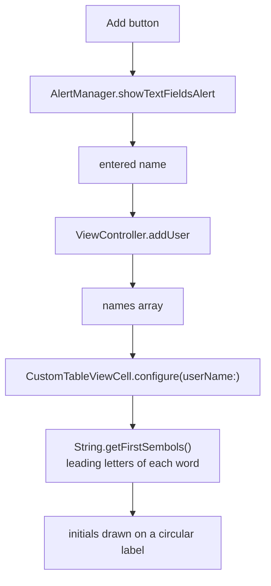

# Default Avatar

*Generated initials avatars for users without a profile photo.*

    

## Overview

Every contact list needs a fallback for the missing profile picture. This one derives the initials from the name, renders them on a coloured circle, and lets new entries be added through an alert with a text field.

## How it works



## Implementation notes

- **Initials from a string extension.** `getFirstSembols` handles single and multi word names, so the cell receives a ready string.
- **Alerts behind a manager.** `AlertManager` builds the text field alert and returns the entered value through a completion handler, keeping the controller free of alert construction.
- **Row height fixed deliberately.** `heightForRowAt` returns a constant so the circular avatar keeps its aspect ratio regardless of the name length.
- **No image assets involved.** The avatar is a label on a rounded view, which means no download, no cache and no placeholder handling.

## Project structure

```
DefaultAvatar/
├── Cells/        CustomTableViewCell
├── Service/      AlertManager
├── Controller/   ViewController
└── Extensions/   String+Extensions
```

## Requirements

Xcode 15 or later, iOS 17.5 or later. No external dependencies.
